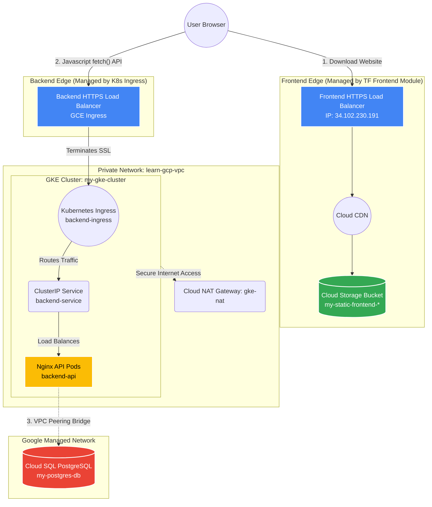

# End-to-End GCP Architecture

Here is the updated visual representation of the enterprise-grade architecture deployed via your newly structured Terraform modules (Network, Database, GKE, and Frontend) and Kubernetes manifests.

## How the Traffic Flows

1. **The Initial Visit:** When you type `https://34.102.230.191` into your browser, you hit the **Frontend Load Balancer** provisioned by the `frontend` Terraform module. 
2. **Caching:** The Load Balancer checks **Cloud CDN**. If the website is cached, it serves it instantly. If not, it pulls the `index.html` file from your globally unique **Cloud Storage Bucket**.
3. **The Javascript Execution:** Your browser downloads `index.html` and sees the Javascript `<script>` tag. The Javascript is instructed to make a background `fetch()` request to get the data.
4. **The API Call:** The Javascript sends a secure request to the **Backend Load Balancer** (provisioned by the GKE Ingress controller). 
5. **Kubernetes Routing:** The Backend Load Balancer decrypts the SSL traffic and passes it to your GKE **Ingress** (`backend-ingress`). The Ingress looks at the rules and forwards it to the **Service** (`backend-service`), which load-balances the traffic across your **Nginx Pods** (`backend-api`).
6. **The Database Query:** The Nginx Pod needs data. It reaches out across the **VPC Peering Bridge** to the private **Cloud SQL PostgreSQL** database (`my-postgres-db`). Because both the Pods and the Database have private IPs, this traffic never touches the public internet.
7. **The Return:** The database returns the data, the Pod formats it as JSON, and sends it all the way back up the chain to your browser!

*(Note: The **Cloud NAT Gateway** (`gke-nat`) sits quietly on the side, allowing your private GKE nodes to download software updates from the internet without exposing themselves to hackers).*
