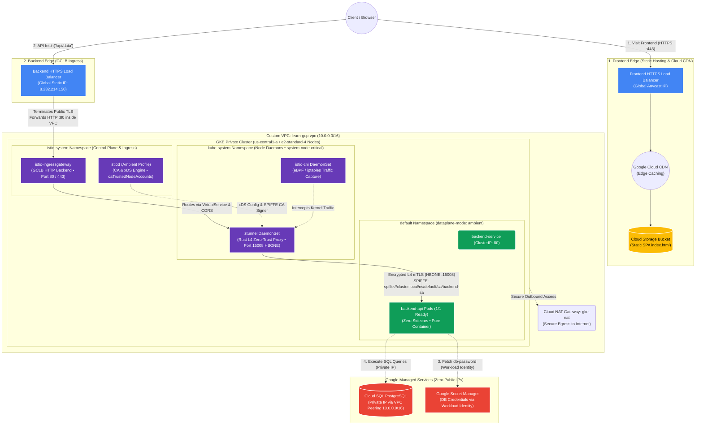
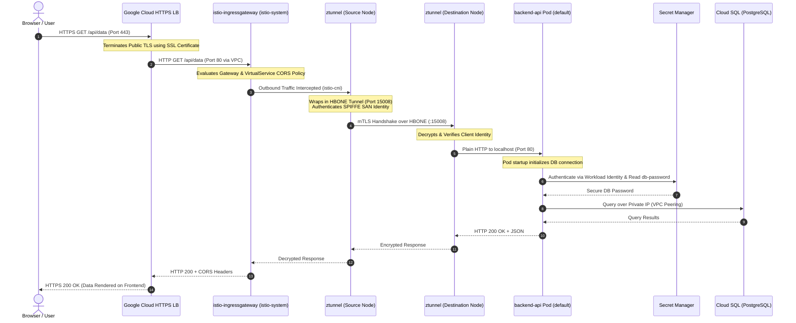

# Enterprise GCP Architecture with Istio Ambient Mesh

This repository provisions a production-grade, zero-trust cloud infrastructure on Google Cloud Platform (GCP) using **Terraform**, **GKE (Google Kubernetes Engine)**, and **Istio Ambient Mode** (Sidecar-less Service Mesh).

---

## 🏗️ Architecture Diagram



---

## 🔄 Detailed Request Lifecycle (Sequence Diagram)



---

## 🌟 Key Architectural Highlights

### 1. Istio Ambient Mode (Sidecar-less Service Mesh)
* **Zero Pod Restarts & Bloat:** No `istio-proxy` Envoy sidecar containers injected into application pods (`1/1 Ready`).
* **Node-Level `ztunnel` in `kube-system`:** Deployed with `system-node-critical` priority class to guarantee scheduling on all worker nodes.
* **Kernel Traffic Interception:** `istio-cni` transparently routes pod traffic to `ztunnel` using Linux kernel routing (`eBPF`/`iptables`).
* **Authenticated Node Proxying:** Configured `istiod` with `caTrustedNodeAccounts = ["kube-system/ztunnel", "istio-system/ztunnel"]` for secure SPIFFE identity certificate generation.

### 2. Edge-to-Mesh TLS Termination Pattern
* **Public Internet ➔ GCLB:** Encrypted via **HTTPS (Port 443)** using SSL certificates.
* **GCLB ➔ Ingress Gateway:** High-performance **HTTP (Port 80)** across Google's private, encrypted internal VPC backbone, eliminating redundant double-encryption overhead.
* **Ingress Gateway ➔ Workload Pods:** Fully zero-trust encrypted with **mutual TLS (mTLS)** over **HBONE (Port 15008)** with cryptographic SPIFFE identities (`spiffe://cluster.local/ns/default/sa/backend-sa`).

### 3. Enterprise Security & Zero-Trust
* **Workload Identity Federation:** No static service account keys in pods. Kubernetes Service Accounts bind directly to GCP IAM roles.
* **GCP Secret Manager:** Database passwords dynamically fetched at runtime.
* **Private Network Isolation:** GKE cluster and Cloud SQL instances have 0 public IPs; communication traverses internal VPC peering and Cloud NAT handles outbound internet egress.
* **CORS Support:** Native cross-origin resource sharing (`corsPolicy`) configured on Istio `VirtualService` to seamlessly connect the Cloud CDN frontend with the backend API.

---

## 📁 Repository Structure

```text
├── environments/
│   └── dev/                       # Root Terraform environment
│       ├── main.tf                # Module orchestration & outputs
│       ├── variables.tf           # Environment variables
│       └── provider.tf            # Google, Helm, Kubernetes, and TLS providers
├── modules/
│   ├── network/                   # VPC, Subnets, Firewalls (GCLB & GKE), Cloud NAT
│   ├── database/                  # Cloud SQL PostgreSQL & Private VPC Connection
│   ├── gke/                       # GKE Private Cluster & Node Pools
│   ├── secrets/                   # Secret Manager & Workload Identity IAM
│   ├── frontend/                  # Cloud Storage, Cloud CDN, HTTPS Load Balancer
│   ├── istio/                     # Istio Base, CNI, istiod (Ambient), ztunnel, and Gateway
│   └── backend_app/               # Helm Chart for Backend Deployment, Service, Ingress, VS
```

---

## 🛠️ Verification & Testing

### 1. Verify Istio Ambient Components
```bash
# Check ztunnel and istio-cni daemons
kubectl get daemonsets,pods -n kube-system -l app=ztunnel
kubectl get daemonsets,pods -n kube-system -l app=istio-cni

# Check istiod control plane
kubectl get pods -n istio-system -l app=istiod
```

### 2. Verify Backend Pods (Sidecar-less)
```bash
# Confirm pods are 1/1 (Zero Sidecars)
kubectl get pods -n default -l app=backend-api
```

### 3. Verify Load Balancer Health & Ingress
```bash
kubectl describe ingress backend-ingress -n istio-system | grep backends
# Output: {"k8s1-...-istio-ingressgateway-80-...": "HEALTHY"}
```

### 4. Test Public Endpoints
```bash
# Test Backend API via GCLB + Ambient Mesh
curl -k -i https://<BACKEND_STATIC_IP>/api/data

# Test Frontend Website via Cloud CDN
curl -k -i https://<FRONTEND_STATIC_IP>
```

---

## 🧹 Teardown

To destroy all cloud resources when finished testing:

```bash
cd environments/dev
terraform destroy -auto-approve
```
