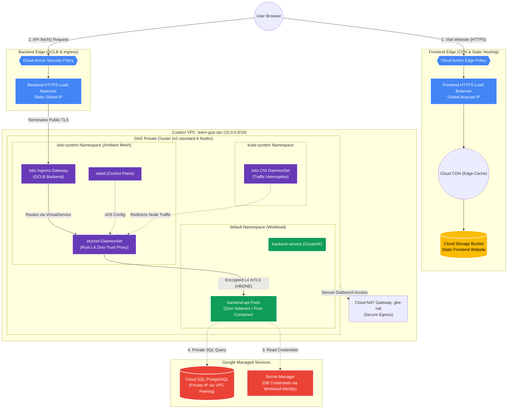

# Enterprise GCP Architecture with Istio Ambient Mesh

This repository provisions an end-to-end, enterprise-grade cloud architecture on Google Cloud Platform (GCP) using **Terraform**, **Kubernetes (GKE)**, and **Istio Ambient Mode** (Sidecar-less Service Mesh).

---

## 🏗️ Architecture Diagram



---

## 🚀 Key Architectural Innovations

### 1. Istio Ambient Mode (Sidecar-less Mesh)
* **Zero Pod Bloat:** Unlike classic Istio which injects an `istio-proxy` Envoy container into every application pod, Ambient mode runs pure single-container pods (`1/1 Ready`).
* **Node-Level `ztunnel`:** A dedicated Rust-based zero-trust tunnel daemonset runs on each node, handling L4 mutual TLS (mTLS) and telemetry with minimal memory footprint (~15MB vs ~150MB per pod).
* **`istio-cni` in `kube-system`:** Transparently captures pod network traffic at the kernel level and redirects it to `ztunnel` without mutating pod specifications.

### 2. Dual-Layer Edge Security & Performance
* **Frontend:** Google Cloud Armor WAF + Cloud CDN caching on Cloud Storage bucket objects.
* **Backend:** Google Cloud Armor + External HTTP(S) Load Balancer bound to a reserved static IP, routing to the GKE Ingress Gateway.

### 3. Enterprise Security & Secrets
* **Workload Identity Federation:** No static GCP service account keys in pods. The backend pod authenticates directly to Google Cloud APIs using Kubernetes Service Accounts.
* **Secret Manager Integration:** Database credentials are securely injected at runtime from GCP Secret Manager.
* **Private Network Isolation:** GKE cluster and Cloud SQL instances have 0 public IPs; communication traverses internal VPC peering and Cloud NAT handles outbound traffic.

---

## 📁 Repository Structure

```
├── environments/
│   └── dev/                  # Root Terraform environment (wires all modules)
│       ├── main.tf
│       ├── variables.tf
│       └── outputs.tf
├── modules/
│   ├── network/              # VPC, Subnets, Firewalls (GKE Master & GCLB), Cloud NAT
│   ├── database/             # Cloud SQL PostgreSQL & Private Service Access
│   ├── gke/                  # GKE Private Cluster & e2-standard-4 Node Pools
│   ├── secrets/              # GCP Secret Manager & Workload Identity IAM bindings
│   ├── frontend/             # Cloud Storage, Cloud CDN, HTTPS Load Balancer, WAF
│   ├── istio/                # Istio Base, Ambient CNI, istiod, ztunnel, and Ingress
│   └── backend_app/          # Helm chart for Backend Deployment & Gateway routing
```

---

## 🛠️ Verification & Testing Commands

```bash
# 1. Verify Istio Ambient Mode components
kubectl get daemonsets,pods -n kube-system -l app=istio-cni
kubectl get daemonsets,pods -n istio-system -l app=ztunnel

# 2. Verify backend pod is running without sidecars (1/1)
kubectl get pods -l app=backend-api

# 3. Test API connectivity
curl -k https://<BACKEND_STATIC_IP>/api/data
```
