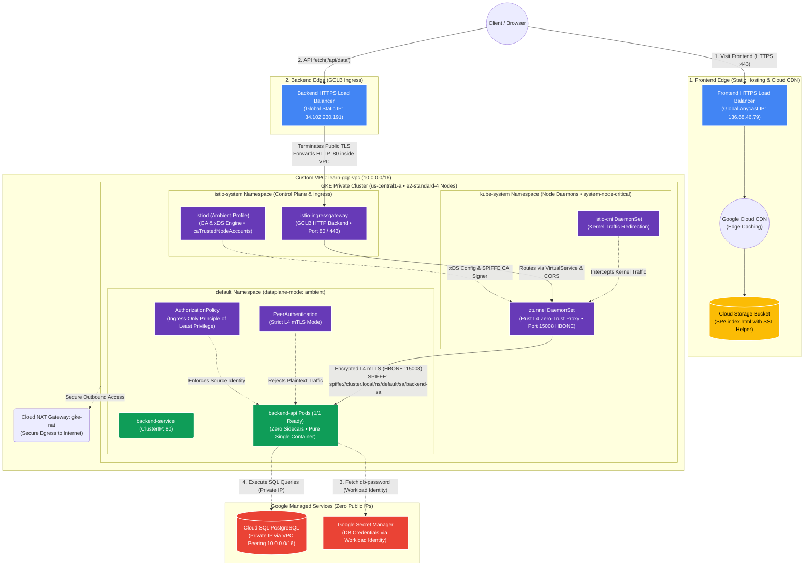
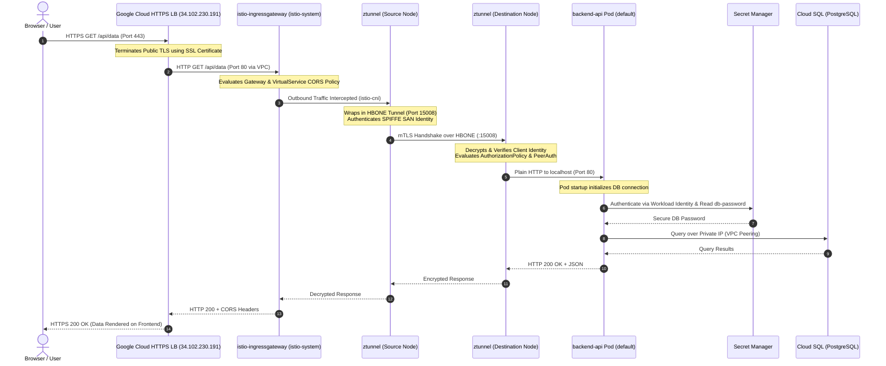

# Enterprise GCP Architecture with Istio Ambient Mesh

This repository provisions a production-grade, zero-trust cloud infrastructure on Google Cloud Platform (GCP) using **Terraform**, **GKE (Google Kubernetes Engine)**, and **Istio Ambient Mode** (Sidecar-less Service Mesh).

---

## 🏗️ Architecture Diagram



---

## 🔄 Detailed Request Lifecycle (Sequence Diagram)



---

## 🌟 Key Architectural Highlights

### 1. Istio Ambient Mode (Sidecar-less Service Mesh)
* **Zero Pod Restarts & Bloat:** No `istio-proxy` Envoy sidecar containers injected into application pods (`1/1 Ready`), saving up to 90% in cluster memory.
* **Node-Level `ztunnel` in `kube-system`:** Deployed with `system-node-critical` priority class to guarantee scheduling on all worker nodes.
* **Kernel Traffic Interception:** `istio-cni` transparently routes pod traffic to `ztunnel` using Linux kernel routing (`eBPF`/`iptables`).
* **Authenticated Node Proxying:** Configured `istiod` with `caTrustedNodeAccounts = ["kube-system/ztunnel"]` for secure SPIFFE identity certificate generation.

### 2. Edge-to-Mesh TLS Termination Pattern
* **Public Internet ➔ GCLB:** Encrypted via **HTTPS (Port 443)** using SSL certificates.
* **GCLB ➔ Ingress Gateway:** High-performance **HTTP (Port 80)** across Google's private, encrypted internal VPC backbone, eliminating redundant double-encryption overhead.
* **Ingress Gateway ➔ Workload Pods:** Fully zero-trust encrypted with **mutual TLS (mTLS)** over **HBONE (Port 15008)** with cryptographic SPIFFE identities (`spiffe://cluster.local/ns/default/sa/backend-sa`).

### 3. Zero-Trust Security Policies
* **Strict `PeerAuthentication`:** Namespace-wide enforcement rejecting all non-mTLS plaintext connections.
* **Least-Privilege `AuthorizationPolicy`:** Workload pods only accept traffic verified to originate from `istio-ingressgateway`, actively blocking lateral east-west attacks.
* **Workload Identity Federation:** No static service account keys in pods. Kubernetes Service Account `backend-sa` binds directly to GCP IAM role `roles/secretmanager.secretAccessor`.
* **GCP Secret Manager:** Database passwords dynamically fetched at pod startup into `/etc/secrets/db_password.txt`.
* **Private Network Isolation:** GKE cluster and Cloud SQL instances have 0 public IPs; communication traverses internal VPC peering.

### 4. Cross-Origin Resource Sharing (CORS) & Cloud CDN
* **Preflight & Direct CORS Support:** Both the Istio `VirtualService` and backend Nginx configuration handle `OPTIONS`, `GET`, `POST` with `Access-Control-Allow-Origin: *`.
* **Frontend SSL Helper:** Interactive SPA featuring a 1-click certificate trust mechanism for testing self-signed certificates with zero friction.

---

## 📁 Repository Structure

```text
├── environments/
│   └── dev/                       # Root Terraform environment
│       ├── main.tf                # Module orchestration & outputs
│       ├── variables.tf           # Environment variables
│       └── provider.tf            # Google, Helm, Kubernetes, and TLS providers
├── modules/
│   ├── network/                   # VPC, Subnets, Firewalls (GCLB & GKE), Cloud NAT, Cloud Armor
│   ├── database/                  # Cloud SQL PostgreSQL & Private VPC Connection
│   ├── gke/                       # GKE Private Cluster & Node Pools
│   ├── secrets/                   # Secret Manager & Workload Identity IAM
│   ├── frontend/                  # Cloud Storage, Cloud CDN, HTTPS Load Balancer
│   ├── istio/                     # Istio Base, CNI, istiod (Ambient), ztunnel, and Gateway
│   └── backend_app/               # Helm Chart for Backend Deployment, Service, Ingress, VS, AuthPolicy
├── scripts/
│   └── test_ambient_mesh.sh       # Automated 7-Step End-to-End Test Suite & Scorecard
└── docs/
    └── IMPROVEMENTS.md            # In-depth security hardening & architectural guide
```

---

## 🧪 Automated Testing & Verification

Run the full end-to-end test suite anytime:

```bash
bash scripts/test_ambient_mesh.sh
```

### Automated Checks Performed:
1. **Control Plane & Daemons:** Checks `istiod`, `istio-cni`, and `ztunnel` across namespaces.
2. **Sidecar-less Status:** Verifies pods run in single-container mode (`1/1 Ready`).
3. **Secret Manager & Workload Identity:** Confirms `db-password` is mounted at `/etc/secrets/db_password.txt`.
4. **Internal Mesh Routing & Authorization:** Validates routing from authorized Ingress and verifies `AuthorizationPolicy` blocks lateral pod queries.
5. **GCLB Health Checks:** Asserts load balancer backend reports `HEALTHY`.
6. **Public API & CORS:** Verifies `HTTP 200 OK` on `https://34.102.230.191/api/data` with `Access-Control-Allow-Origin: *`.
7. **mTLS Handshake Telemetry:** Validates `ztunnel` HBONE Port 15008 SPIFFE connection logs.

---

## 🧹 Teardown

To cleanly destroy all cloud resources when finished testing:

```bash
cd environments/dev
terraform destroy -auto-approve
```
